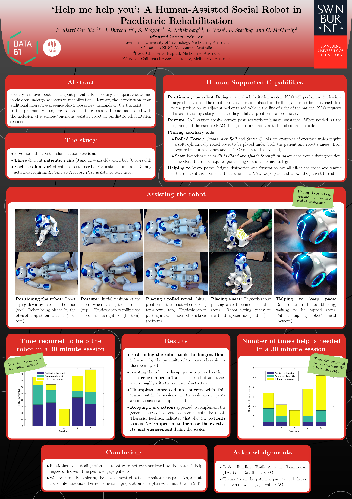

Poster presented in the 28th Australian Conference on Computer-Human Interaction ([OzCHI2016](http://www.ozchi.org/ozchi2016/)) in Launceston (TAS), Australia, 29 Nov - 2 Dec, 2016.

[[Download](https://github.com/FelipMarti/Swinburne-poster-LaTeX-template/raw/master/examples/OzCHI2016.pdf)]
[[BibTeX](/pub/bib/marti2016help_bib)]

Go back to [Publications](/pub.html)

