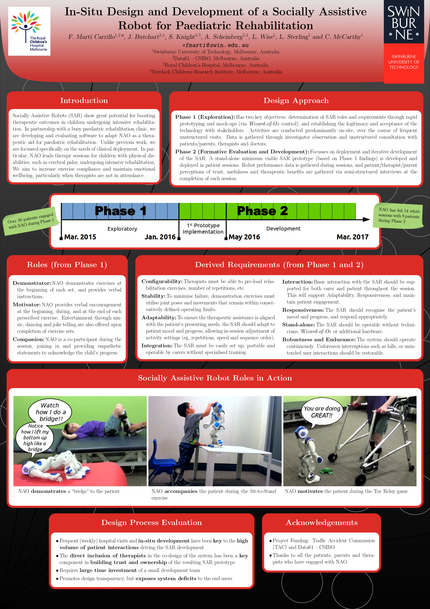

Poster presented in the 2017 ACM/IEEE International Conference on Human-Robot Interaction ([HRI2017](http://humanrobotinteraction.org/2017/)) in Vienna, Austria, March 6–9, 2017.

[[Download](https://github.com/FelipMarti/Swinburne-poster-LaTeX-template/raw/master/examples/HRI2017.pdf)]
[[BibTeX](/pub/bib/marti2017insitu_bib)]

Go back to [Publications](/pub.html)

